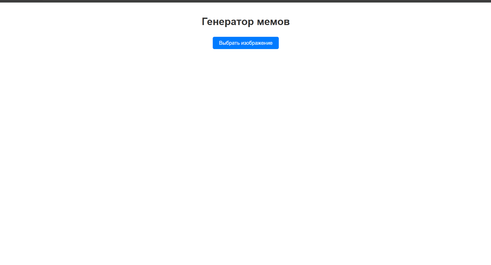
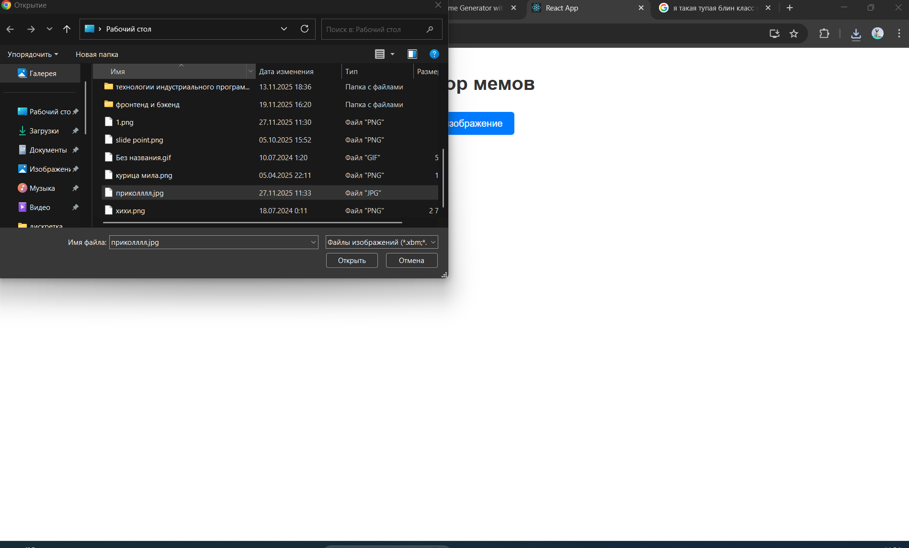
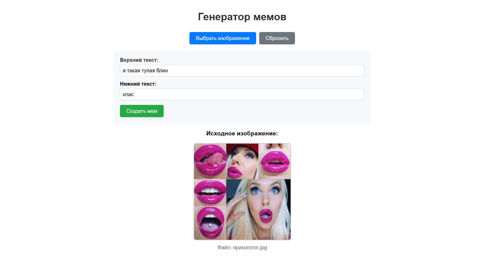
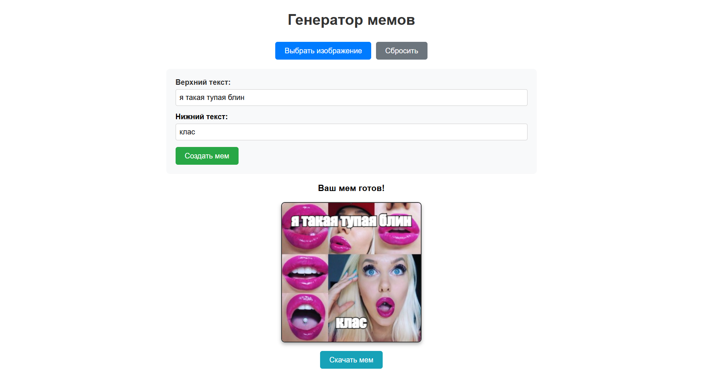
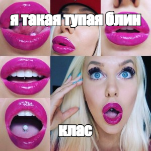

# Генератор мемов (простая версия)

Генератор мемов - это веб-приложение на React, которое позволяет пользователям создавать мемы. Пользователи могут загружать изображения, добавлять верхний и нижний текст, и скачивать готовые мемы.

Ссылка: https://dzemlarisa.github.io/my-mem-generator/

# Основные возможности:

Загрузка изображений

  

  

Добавление текста

  

Предпросмотр (после нажатия кнопки "Создать мем")

  

Скачивание результата

  

# Вывод:
Было создано полнофункциональное веб-приложение для генерации мемов с удобным пользовательским интерфейсом